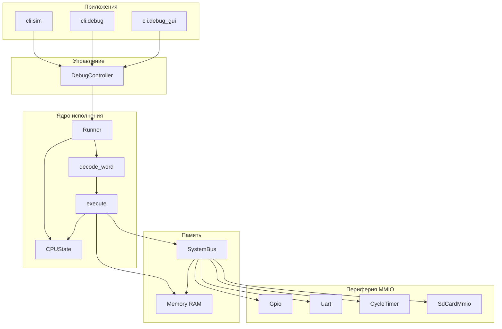

# Архитектура E32C (функциональный симулятор)

Документ описывает **программную архитектуру** репозитория `e32c-sim`: модель процессора E32C, память, периферию MMIO, цикл исполнения и окружение (CLI, GUI, тесты). Это не описание кремниевого чипа, а **уровень абстракции Python-симулятора**, согласованный с [ISA](isa/spec.md) и [картой MMIO](mmio.md).

## 1. Назначение системы

- **Цель:** исполнять программы в виде 32-битных слов по спецификации E32C с предсказуемой семантикой (регистры, флаги, память, исключения).
- **Режимы использования:** пакетный прогон (`cli.sim`), пошаговая отладка (`cli.debug`), графический отладчик Tk (`cli.debug_gui`, `e32c-debug-gui`).
- **Периферия:** упрощённые модели устройств за единым окном MMIO; опциональный **файловый образ** для блочного «SD»-устройства.

## 2. Высокоуровневая структура

- `**CPUState`:** 32 GPR, слово флагов, SPR, признак `halted`. **R0** читается как ноль; по ABI **R30** — указатель стека (**SP**); **R31** — указатель команд (PC/IP).
- `**Memory`:** линейный массив слов **только для RAM** `[0, size)`.
- `**SystemBus`:** реализует контракт `WordMemory`: чтение/запись слова либо в RAM, либо в окне MMIO `[mmio_base, mmio_base + 0x4000)`; иначе — ошибка диапазона.
- `**Runner`:** цикл **fetch → decode → execute**; при отсутствии явного перехода **PC ← PC + 4**; учёт **циклов** и хук после шага (`on_step_end` на шине, трейс для GUI).

## 3. Модель ISA (кратко)

Полная семантика: [docs/isa/spec.md](isa/spec.md). Кодировки: [docs/isa/opcodes.yaml](isa/opcodes.yaml).

| Аспект           | Правило в симуляторе                                                                                                                                           |
| ---------------- | -------------------------------------------------------------------------------------------------------------------------------------------------------------- |
| Слово            | 32 бита, little-endian в памяти программ/образов                                                                                                               |
| Доступ к памяти  | `LDR` / `STR` только по **выровненным** адресам (`addr % 4 == 0`)                                                                                              |
| Маска load/store | Биты `mask` выбирают **байты** слова (см. `execute._apply_ldr_mask` / `_merge_str_mask`)                                                                       |
| Немедленники     | `ADDI`/`SUBI`: 16-bit со знаковым расширением; ветвления/EA: 11-bit signed                                                                                     |
| Флаги            | `ADDS`/`SUBS` — знаковая (two’s complement) арифметика с обновлением Z, C (беззнаковый перенос/заём), V (знаковое переполнение), S; см. [spec.md](isa/spec.md) |
| Особые слова     | `NOP = 0`, `HALT = 0xFFFFFFFF`                                                                                                                                 |
| SPR / IRQ        | Минимум `SAVED_IRQ_PC`, `IRQ_VECTOR`; таймер может вызвать упрощённое прерывание при `Intenable`                                                               |

Декодирование строится по YAML-таблице (`core.decode`); дизассемблер и минимальный ассемблер (`core.asm`) используют те же определения.

## 4. Адресное пространство и шина

- **RAM:** адреса `0 … ram.size-1` (размер задаётся при создании `Memory`, по умолчанию — из кода вызова).
- **MMIO:** фиксированное окно **16 KiB** от `mmio_base` (по умолчанию `0xFFFF_0000`). Внутри — смещения устройств согласно [mmio.md](mmio.md): GPIO, UART, Timer, SD/block.
- **Маршрутизация:** `SystemBus.read_word` / `write_word` сначала проверяют выравнивание, затем диапазон RAM, затем MMIO; для MMIO вызываются делегаты устройств по относительному смещению.

Подробнее по регистрам UART/таймера: [peripherals.md](peripherals.md).

## 5. Периферия

| Модуль | Файл                     | Роль                                                                 |
| ------ | ------------------------ | -------------------------------------------------------------------- |
| GPIO   | `peripherals/gpio.py`    | 32-битный выходной защёлка                                           |
| UART   | `peripherals/uart.py`    | TX/RX очереди, STATUS                                                |
| Timer  | `peripherals/timer.py`   | 64-bit счётчик циклов, compare, IRQ логика                           |
| SD     | `peripherals/sd_card.py` | Буфер сектора 512 байт, LBA, команды read/write/flush, файл на хосте |

После каждой инструкции `Runner` вызывает `SystemBus.on_step_end(cycles, state, return_pc)` — таймер сравнивает накопленные циклы с порогом и при выполнении условий может выставить прерывание (с сохранением `return_pc` в SPR).

## 6. Загрузка программ и ассемблирование

- `**core.loader`:** запись слов/байт в `Memory` или в объект с методом `write_word` / `write_bytes` (шина поддерживает посекторную запись в RAM через `write_bytes` для удобства загрузчиков).
- **Hex-файлы:** строки с 32-битными словами (см. примеры в `examples/*.hex`).
- `**core.asm`:** построчная сборка мнемоник в слова (для демо и быстрых тестов).

## 7. Отладка и GUI

- `**DebugController`:** оборачивает `CPUState`, `Runner`, ссылку на память (`Memory` или `SystemBus`); шаг, сброс, точки останова, снимок для UI (регистры, листинг, MMIO включая SD).
- `**DebuggerApp` (tkinter):** отображение памяти, дизассемблирование, панель MMIO, вкладка **Storage** для монтирования/создания SD-образа, трейс шагов.

Режим **без MMIO** (`use_mmio=False`) использует голый `Memory` — удобно для чисто вычислительных тестов.

## 8. CLI entry points

| Модуль          | Назначение                                                                                       |
| --------------- | ------------------------------------------------------------------------------------------------ |
| `cli.sim`       | Прогон с лимитом шагов, отчёт инструкций/циклов                                                  |
| `cli.debug`     | Текстовая отладка                                                                                |
| `cli.debug_gui` | Запуск GUI; флаги `--mmio`, `--sd-image`, `--sd-create-sectors` согласуются с конструктором шины |

Точка входа пакета: `e32c-debug-gui` → `cli.debug_gui.app:main` (код окна в каталоге `cli/debug_gui/`). Общие флаги сессии (`--hex`, `--bin`, `--mmio`, SD) вынесены в `cli.debug_common` для REPL (`cli.debug`) и GUI.

## 9. Зависимости и тесты

- **Python ≥ 3.10**, зависимость времени выполнения: **PyYAML** (таблица опкодов).
- **pytest**, **hypothesis**, **ruff**, **pytest-cov** — опционально в `[dev]` ([pyproject.toml](../pyproject.toml)).
- Тесты: `tests/` — ISA step-векторы (`tests/isa/test_vectors.yaml`), property-тесты, `test/equiv` (Python programs), RTL через `scripts/verify_all.py`.

| Уровень | Python | RTL / cosim |
|--------|--------|-------------|
| PR (`verify_all --quick`) | pytest −slow, equiv | smoke benches + `compare_rtl_python` |
| Nightly (`--full`) | + Hypothesis slow | + `tb_core_isa`, longrun, `compare_rtl_python --full` |
| Плата | — | Gowin bitstream ([test/fpga/README.md](../test/fpga/README.md)) |

Отложенные эпики: [docs/BACKLOG.md](BACKLOG.md).

## 10. Связанные документы

- [ISA spec](isa/spec.md) — каноническая семантика инструкций  
- [MMIO map](mmio.md) — адреса устройств  
- [Периферия (детали таймера и UART)](peripherals.md)  
- Примеры: `examples/launch_smoke_gui.py`, `examples/launch_sd_gui_demo.py`, `docs/mmio.md` (команды SD)

