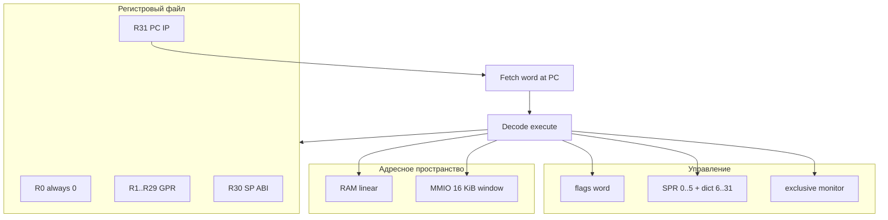

# Программная архитектура (full)

Эталон поведения: Python `CPUState(core_variant="full")` + [ISA spec](../isa/spec.md) v1.5.

## Модель программиста

## Регистры общего назначения (GPR)

| Индекс | Роль     | Правила                                                         |
| ------ | -------- | --------------------------------------------------------------- |
| 0      | R0       | Чтение = 0; запись игнорируется                                 |
| 1–29   | GPR      | Обычные 32-битные регистры, арифметика mod 2³²                  |
| 30     | SP (ABI) | Аппаратно обычный GPR; соглашение вызывающего                   |
| 31     | PC / IP  | Указатель команд; после инструкции без перехода **PC ← PC + 4** |

**Python:** `state.reg_read` / `reg_write`, `state.pc` = R31.

**RTL full (`core.sv`):** PC в отдельном `dbg_pc`; `**regs[31]` не связан с PC** (в отличие от `core_tn9k.sv`).

## Слово инструкции

- 32 бита, opcode в **[31:26]** (6 бит).
- Little-endian в памяти программ.
- Особые слова: **NOP** = `0x00000000`, **HALT** = `0xFFFFFFFF`.

## Флаги (не SPR)

Одно 32-битное слово `flags`; для ISA значимы биты 0–4:

| Бит | Имя       | Назначение                                          |
| --- | --------- | --------------------------------------------------- |
| 0   | Intenable | Разрешение доставки IRQ (`EI`/`DI`)                 |
| 1   | Zero      | Результат последней flag-операции                   |
| 2   | Carry     | Беззнаковый перенос/заём (ARM-стиль для ADDS/SUBS)  |
| 3   | Overflow  | Знаковое переполнение                               |
| 4   | Sign      | Знак результата (для ADDS/SUBS — бит 31 результата) |

Операции **без** суффикса `S` / без ADCS/SBCS/ANDS/ADDSI/SUBSI **не меняют** Z/C/V/S.

**Python:** `core/flags.py`, обновление в `execute.py`.

**RTL full:** отдельные триггеры `zf`, `cf`, `vf`, `sf`; `int_enable` — **отдельный** flip-flop (не бит 0 слова flags).

## SPR (special-purpose registers)

| Индекс | Имя          | R/W | Назначение                     |
| ------ | ------------ | --- | ------------------------------ |
| 0      | SAVED_IRQ_PC | RW  | Адрес возврата из IRQ          |
| 1      | IRQ_VECTOR   | RW  | Вектор обработчика             |
| 2      | IRQ_MASK     | RW  | Бит i=1: линия i замаскирована |
| 3      | CORE_INFO    | RO  | `0xE32C0100` для full          |
| 4      | ISA_REVISION | RO  | `0x00010005`                   |
| 5      | FEATURES     | RO  | `0x0000000B`                   |
| 6–31   | —            | —   | Чтение 0, запись игнорируется  |

Поле инструкции SPR: биты **[15:11]** (5 бит).

## Память и адресация

### Программная память (инструкции)

Fetch 32-битного слова по адресу PC (выравнивание на 4 байта подразумевается моделью).

### Данные (LDR/STR семейство)

- **EA** = базовый регистр + знаковое 11-битное смещение (или варианты pre/post index).
- **Выравнивание:** `EA % 4 == 0`, иначе `MisalignedAccess` (Python).
- **Маска** `mask` в **[15:11]** (5 бит в spec): байт k выбирается битом k; в Python/RTL сегодня используются **биты 0–3** (младшие 4 байта слова).

### MMIO

Окно **16 KiB** от `0xFFFF_0000` (по умолчанию): GPIO, UART, Timer, SD — см. [mmio.md](../mmio.md).

Loads/stores к MMIO проходят через ту же шину, что и RAM (в Python — `SystemBus`).

## Монитор эксклюзивного доступа (LDREX/STREX)

Упрощённая модель без snoop шины:

1. **LDREX:** запомнить `exclusive_addr`, `exclusive_valid ← 1`, выполнить load.
2. **STREX:** если адрес совпал и monitor valid — store, status←0; иначе status←1, без store.
3. Любой обычный LDR/STR сбрасывает `exclusive_valid`.

**Python:** `CPUState.exclusive_addr`, `exclusive_valid` в `execute.py`.

**RTL full:** `exclusive_addr`, `exclusive_valid` в `core.sv`.

## Исключения и особые случаи

| Событие             | Python               | Целевое поведение full                                   |
| ------------------- | -------------------- | -------------------------------------------------------- |
| Неизвестный opcode  | `IllegalInstruction` | Согласовать с RTL: исключение или `illegal_instr` + PC+4 |
| NOP (`0`)           | Нет эффектов         | NOP, PC+4                                                |
| HALT (`0xFFFFFFFF`) | `halted ← true`      | Останов fetch / `dbg_halted`                             |
| Misaligned LDR/STR  | `MisalignedAccess`   | Проверка EA перед AXI                                    |

## Прерывания (упрощённая модель)

- Линии `irq_lines[31:0]`; доставка при **Intenable**, не в `irq_in_service`, линия не замаскирована.
- При входе: **SAVED_IRQ_PC ← return PC**, переход на **IRQ_VECTOR**.
- **IRET:** восстановить PC из SPR0, сбросить `in_service`.

**Python:** `raise_irq(return_pc)` после шага (таймер в `SystemBus.on_step_end`); `return_pc` — PC **после** исполненной инструкции.

**RTL:** вход в `ST_FETCH_REQ` при `irq_pending`; `saved_irq_pc ← cur_pc` (`dbg_pc` в момент ack).

Подробнее: [03-microarchitecture.md](03-microarchitecture.md).

## Вариант full vs другие

|           | full         | tn9k         | lite         |
| --------- | ------------ | ------------ | ------------ |
| CORE_INFO | `0xE32C0100` | `0xE32C0110` | `0xE32C0120` |
| MUL       | да           | нет          | нет          |
| LDREX     | да           | нет (RTL)    | нет          |
| ISA       | полная       | subset       | stub         |

См. [profiles.md](../profiles.md), [06-parity-matrix.md](06-parity-matrix.md).