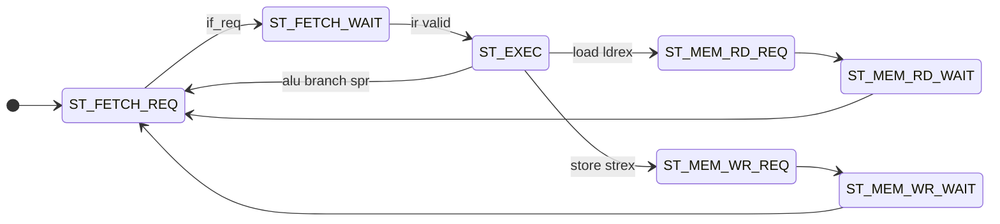
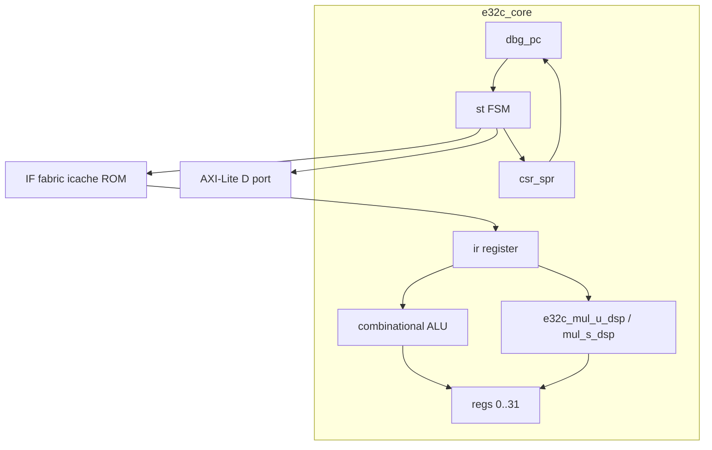

# Микроархитектура RTL (full)

Модуль: [`test/src/core.sv`](../../test/src/core.sv).  
Это **не** суперскалярный и **не** 3-стадийный pipeline (`FEAT_PIPELINE_3 = 0` в [cores.yaml](../isa/cores.yaml)).

## Модель: single-issue FSM

Одна инструкция в полёте. Фазы разнесены по состояниям для AXI и fetch.



### Состояния

| ID | Имя | Длительность (типично) |
|----|-----|------------------------|
| 0 | ST_FETCH_REQ | 1+ циклов (stall, IRQ redirect) |
| 1 | ST_FETCH_WAIT | 1 (ожидание `if_resp_valid`) |
| 2 | ST_EXEC | 1 |
| 3 | ST_MEM_RD_REQ | 1 (AXI AR) |
| 4 | ST_MEM_RD_WAIT | 1+ (AXI R) |
| 5 | ST_MEM_WR_REQ | 1 (AXI AW/W) |
| 6 | ST_MEM_WR_WAIT | 1+ (AXI B) |

**Минимальная латентность** (идеальная шина, без stall):

- ALU / branch / mul / SPR: **3 цикла** (fetch req → fetch wait → exec).
- Load/store: **+2–3 цикла** (mem req/wait).

Python **не** моделирует эти фазы; `cycles.py` даёт абстрактную стоимость на мнемонику.

## Блок-схема



## Fetch-интерфейс

| Сигнал | Направление | Описание |
|--------|-------------|----------|
| `if_req_valid`, `if_req_addr` | out | Запрос строки по `dbg_pc` или IRQ vector |
| `if_resp_valid`, `if_resp_data` | in | Слово инструкции |
| `if_stall` | in | Удержание в ST_FETCH_REQ |

В [`top.sv`](../../test/src/top.sv): icache + AXI, BRAM ROM, или `fetch_rom_nop` (FPGA TN9K).

## Data-интерфейс (AXI4-Lite)

| Канал | Использование |
|-------|----------------|
| AR / R | LDR, LDREX |
| AW / W / B | STR, STREX (успех) |

- Адрес: `R[raddr] + imm` (знаковое 11-бит).
- `d_wstrb` / маска load: `ir[14:11]` (4 бита).
- Pre/post index: обновление базы в фазе MEM_*_WAIT.

## Execute (ST_EXEC)

Комбинационный decode из `ir`:

- `op = ir[31:26]`, `r1/r2/rd` из стандартных полей.
- ALU: ADD, SUB, shifts, ROL/ROR, ADDI/SUBI immediates.
- Флаги: отдельные ветки OP_ADDS, OP_SUBS, OP_ADCS, …
- Multiply: один цикл EXEC, DSP `mul_dsp.sv`.
- Branches: `take_branch` → обновление `dbg_pc`, `if_req_addr`.
- SPR: `csr_wr_en`, `csr_rd_idx_eff` (комб. override для READSPR).
- LDREX: arm monitor + переход в MEM_RD.
- Illegal: `illegal_instr_r`, PC+4 (см. parity doc).

## SPR / IRQ (`csr_spr.sv`)

Параметры для full:

```systemverilog
.CORE_INFO_VAL(E32C_CORE_INFO_FULL),   // 32'hE32C0100
.ISA_REVISION_VAL(E32C_ISA_REVISION),  // 32'h00010005
.FEATURES_VAL(E32C_FEATURES_FULL)      // 32'h0000000B
```

IRQ:

```
irq_pending = int_enable && !in_service && !iret_exec && (|irq_lines & ~mask)
irq_ack = irq_pending && (st==ST_FETCH_REQ) && !if_stall && !dbg_halted
```

При `irq_ack`: `saved_irq_pc <= cur_pc`, `in_service <= 1`, `irq_vector` из SPR1.

## Exclusive monitor

| Регистр | Назначение |
|---------|------------|
| `exclusive_addr` | Адрес LDREX |
| `exclusive_valid` | Monitor armed |

Сброс при любом LDR/STR/STREX fail. STREX success: full word store, status 0 в WR_WAIT.

## Ресеты и дефолты (RTL full сегодня)

| Параметр | Значение при reset |
|----------|-------------------|
| `dbg_pc` | 0 |
| `int_enable` | **1** (отличие от Python flags=0) |
| IRQ vector (SPR1) | `0x100` (в `csr_spr`) |
| `illegal_instr_r` | 0 (но sticky — см. parity) |

## Интеграция в SoC

[`soc_top`](../../test/src/top.sv): `USE_TN9K_CORE=0`, `USE_LITE_CORE=0` → `e32c_core`.

- IRQ line 0: timer (level-sensitive).
- GPIO/UART/timer/SD на AXI-APB за декодером.

Симуляция: `test/iverilog_soc_psram.f`, cosim `test/compare_rtl_python.py` (smoke, не полный ISA).

## Целевая микроархитектура для parity с Python

Рекомендации (без смены внешних портов):

1. **R31 ↔ PC** — опциональный параметр `TIE_R31_PC` или всегда как в spec.
2. **NOP** — явная ветка для `ir==0`, не illegal.
3. **Misalign** — проверка EA[1:0] перед AXI.
4. **illegal_instr** — импульс на один цикл или сброс в ST_FETCH_REQ.
5. **ANDS sf** — sign результата, не `a[31]&b[31]`.
6. **IRQ saved PC** — согласовать с Python `return_pc` (после insn).
7. **int_enable reset** — 0 как в Python, или документировать осознанное отличие.

Детали: [06-parity-matrix.md](06-parity-matrix.md).
