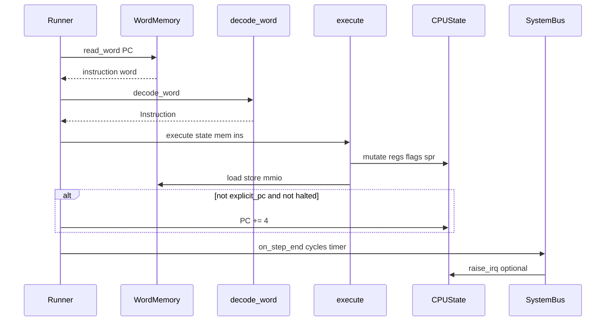

# Референсная модель Python (full)

Каталог: [`src/core/`](../../src/core/). Вариант: `CPUState()` или `CPUState(core_variant="full")`.

## Поток исполнения



### `Runner.step()` ([`runner.py`](../../src/core/runner.py))

1. `old_pc = state.pc`
2. `word = mem.read_word(old_pc)`
3. `ins = decode_word(word)`
4. `explicit_pc = execute(state, mem, ins)`
5. Если не halted и не `explicit_pc` → `PC = old_pc + 4`
6. `cycle_counter += cycles_for_mnemonic(mnemonic)`
7. `SystemBus.on_step_end` — таймер, возможный IRQ

## Модули

| Модуль | Роль |
|--------|------|
| [`state.py`](../../src/core/state.py) | GPR, flags, spr dict, exclusive, `core_variant`, `raise_irq` |
| [`decode.py`](../../src/core/decode.py) | YAML → `Instruction` |
| [`execute.py`](../../src/core/execute.py) | Семантика всех форматов; variant illegal check |
| [`runner.py`](../../src/core/runner.py) | FDE loop |
| [`memory.py`](../../src/core/memory.py) | RAM, align check |
| [`bus.py`](../../src/core/bus.py) | RAM + MMIO decode |
| [`flags.py`](../../src/core/flags.py) | Битовые константы |
| [`spr_constants.py`](../../src/core/spr_constants.py) | SPR индексы, CORE_INFO, FEATURES (generated) |
| [`cycles.py`](../../src/core/cycles.py) | MUL=3, LDR/STR=2, default=1 |
| [`exceptions.py`](../../src/core/exceptions.py) | IllegalInstruction, MisalignedAccess, … |
| [`instruction.py`](../../src/core/instruction.py) | Dataclass decoded insn |
| [`asm.py`](../../src/core/asm.py) / [`disasm.py`](../../src/core/disasm.py) | Сборка / дизассемблер |
| [`debug_controller.py`](../../src/core/debug_controller.py) | GUI/CLI обёртка |

Периферия: [`peripherals/`](../../src/core/peripherals/) — GPIO, UART, timer, SD.

## Decode

- Загрузка [`docs/isa/opcodes.yaml`](../isa/opcodes.yaml) при импорте.
- Спецслучаи: word `0` → NOP; `0xFFFFFFFF` → HALT.
- Unknown opcode → `IllegalInstruction`.

## Execute (диспетчеризация)

По `ins.format`:

| format | Ключевые функции |
|--------|------------------|
| `rrr` | Арифметика, shifts, ROL/ROR, flag ops |
| `imm16` | ADDI, SUBI, ADDSI, SUBSI |
| `load_store` / `store` | `_apply_ldr_mask`, pre/post |
| `strex` | exclusive monitor |
| `mul` / `mul64` / `mla` | 32/64-bit multiply |
| `branch` / `branch_cond` | PC write |
| `spr` | spr_read/write |
| `bare` | EI, DI, IRET, HALT |

Variant gate (начало `execute`):

```python
if m in VARIANT_ILLEGAL_OPCODES.get(state.core_variant, frozenset()):
    raise IllegalInstruction(...)
```

Для **full** множество пустое.

## SPR в Python

- RW: 0, 1, 2 в `state.spr` dict.
- RO 3–5: вычисляются из `VARIANT_*[core_variant]` в `spr_read`.
- `spr_write` к 3–5 игнорируется.

## IRQ в Python

```python
def raise_irq(self, return_pc, line=0):
    if irq_in_service: return
    if not (flags & FLAG_INTENABLE): return
    if spr_read(SPR_IRQ_MASK) & (1 << line): return
    irq_in_service = True
    spr_write(SPR_SAVED_IRQ_PC, return_pc)
    set_pc(spr_read(SPR_IRQ_VECTOR))
```

Таймер (`CycleTimer`) вызывает после шага с `return_pc = state.pc` (уже после +4).

## Циклы (не pipeline)

[`cycles.py`](../../src/core/cycles.py) — учётная модель для отчётов, **не** влияет на порядок операций:

| Mnemonic class | Cycles |
|----------------|--------|
| MUL, SMUL, UMULL, SMULL, MLA | 3 |
| LDR, STR, LDRPRE, … | 2 |
| остальное | 1 |

## Тесты как спецификация

| Набор | Путь |
|-------|------|
| ISA step vectors | [`tests/isa/test_vectors.yaml`](../../tests/isa/test_vectors.yaml) |
| Core state / version | [`tests/core/`](../../tests/core/) |
| Property / integration | [`tests/`](../../tests/) |
| RTL cosim smoke | [`test/compare_rtl_python.py`](../../test/compare_rtl_python.py) |

Для full parity RTL ориентируйтесь на **test_vectors** + **execute.py**, не только на cosim smoke.

## Отличие от RTL (кратко)

См. [06-parity-matrix.md](06-parity-matrix.md): PC/R31, NOP, IRQ timing, illegal policy, ANDS, reset defaults.
